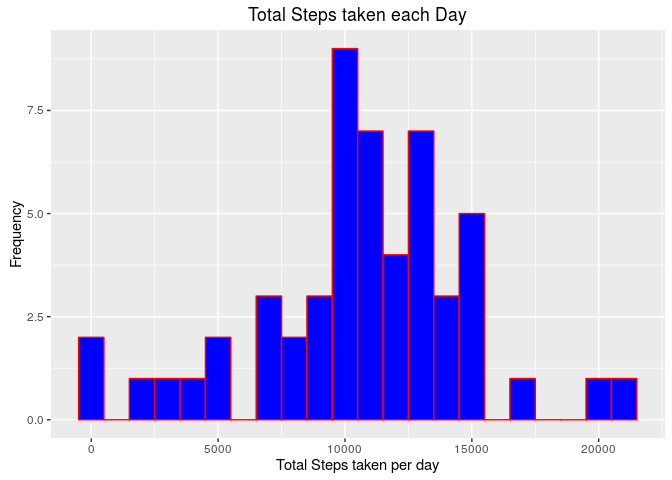
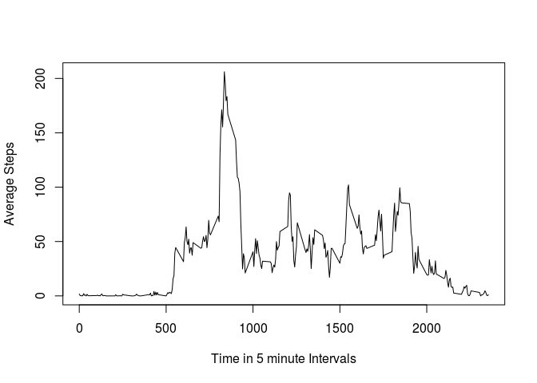
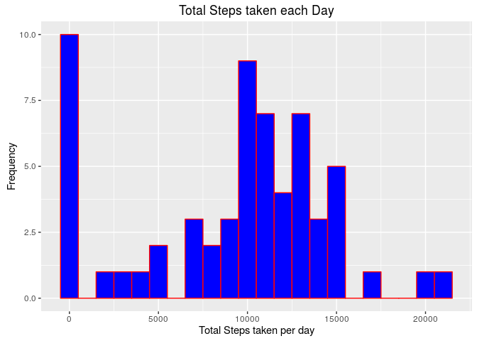
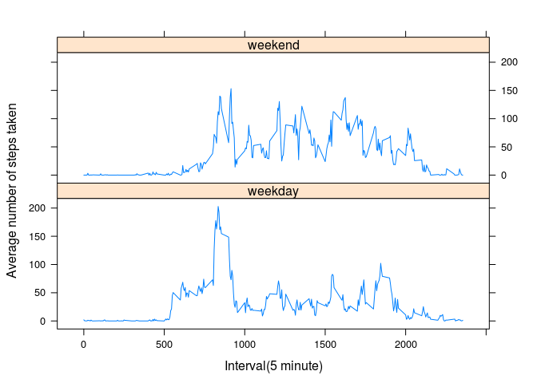

# Reproducible Research: Peer Assessment 1


## Code for reading in the dataset and/or processing the data

```r
activity_data <- read.csv('activity.csv', na.string='NA')
activity_data$date <- as.POSIXct(strptime(activity_data$date, '%Y-%m-%d'))
dim(activity_data)
```

```
## [1] 17568     3
```

```r
# Remove all missing Values
# activity_data <- activity_data[!is.na(activity_data$steps),]
# avgByDate <- aggregate(activity_data$steps, by=list(date=as.factor(activity_data$date)), mean)
```

## What is mean total number of steps taken per day?
### 1. Histogram of the total number of steps taken each day

```r
gStepsPerDay <- group_by(activity_data, date) %>% summarize(totalStepsPerDay=sum(steps))
qplot(gStepsPerDay$totalStepsPerDay, 
      geom = 'histogram', 
      binwidth=1000, 
      main = 'Total Steps taken each Day',
      xlab = 'Total Steps taken per day',
      ylab = 'Frequency',
      fill = I('blue'),
      col = I('red'))
```

```
## Warning: Removed 8 rows containing non-finite values (stat_bin).
```

<!-- -->

### 2. Calculate and report the mean and median total number of steps taken per day

```r
activity_data_no_na <- activity_data[!is.na(activity_data$steps),]
gStepsPerDay <- activity_data_no_na %>% 
    group_by(date) %>% 
    summarize(sumStepsPerDay=sum(steps, na.rm=TRUE))
message('Total Number of steps per day Mean:', mean(gStepsPerDay$sumStepsPerDay), ' Median: ', median(gStepsPerDay$sumStepsPerDay))
```

```
## Total Number of steps per day Mean:10766.1886792453 Median: 10765
```

## What is the average daily activity pattern?

### 1. Make a time series plot (i.e. type = "l") of the 5-minute interval (x-axis) and the average number of steps taken, averaged across all days (y-axis)

```r
gStepsPerDay <- activity_data_no_na %>% 
    group_by(interval) %>% 
    summarize(meanStepsPerDay=mean(steps))
plot(meanStepsPerDay ~ interval, data=gStepsPerDay, type='l', 
     xlab='Time in 5 minute Intervals',
     ylab = 'Average Steps')
```

<!-- -->


### 2. Which 5-minute interval, on average across all the days in the dataset, contains the maximum number of steps?

```r
gStepsPerDay[gStepsPerDay$meanStepsPerDay == max(gStepsPerDay$meanStepsPerDay),]
```

```
## Source: local data frame [1 x 2]
## 
##   interval meanStepsPerDay
##      (int)           (dbl)
## 1      835        206.1698
```
On average across all days, the maximum number of steps is **206.1698** @ **8:35am**.


## Inputing missing values

### 1. Calculate and report the total number of missing values in the dataset (i.e. the total number of rows with NAs)

```r
sum(is.na(activity_data$steps))
```

```
## [1] 2304
```

### 2. Devise a strategy for filling in all of the missing values in the dataset. The strategy does not need to be sophisticated. For example, you could use the mean/median for that day, or the mean for that 5-minute interval, etc. 
Proposed Strategy of filling in missing values in the dataset  
1. Get the mean value for each day.  
2. Get all missing values for each day  
3. Set missing values to mean value of the given day  
4. For cases that mean value for the day is NA then set missing values to 0

### 3. Create a new dataset that is equal to the original dataset but with the missing data filled in.

```r
# Get the mean value for each day
gStepsPerDay <- activity_data %>% 
    group_by(date) %>% 
    summarize(meanStepsPerDay=mean(steps))

# activity_data[activity_data$date == gStepsPerDay$date[1] & is.na(activity_data$steps),]
new_dataset <- activity_data

#Get the missing values for each day
bNA <- is.na(new_dataset$steps)
u <- unique(new_dataset[bNA,'date'])
for (i in 1:length(u)){
  a <- gStepsPerDay[gStepsPerDay$date == u[i],]
  if (is.na(a$meanStepsPerDay)){
    # For cases that mean value for the day is NA then set missing values to 0
    new_dataset[new_dataset$date == a$date & is.na(new_dataset$steps),'steps']<-0
  }else{
    # Set missing values to mean value of the given day
    new_dataset[new_dataset$date == a$date & is.na(new_dataset$steps),'steps']<-a$meanStepsPerDay
  }
}

message('Percentage of missing values: ', mean(is.na(new_dataset$steps)))
```

```
## Percentage of missing values: 0
```

### 4. Make a histogram of the total number of steps taken each day and Calculate and report the mean and median total number of steps taken per day. Do these values differ from the estimates from the first part of the assignment? What is the impact of inputing missing data on the estimates of the total daily number of steps?

```r
gStepsPerDay <- group_by(new_dataset, date) %>% summarize(totalStepsPerDay=sum(steps))
qplot(gStepsPerDay$totalStepsPerDay, 
      geom = 'histogram', 
      binwidth=1000, 
      main = 'Total Steps taken each Day',
      xlab = 'Total Steps taken per day',
      ylab = 'Frequency',
      fill = I('blue'),
      col = I('red'))
```

<!-- -->
There was a spke with regards to the number of incidents of number of steps below 1000 steps in the histogram when we added missing values to the dataset.  

**Calculation for mean and median total number of steps taken per day.**  

```r
gStepsPerDay <- new_dataset %>% 
    group_by(date) %>% 
    summarize(sumStepsPerDay=sum(steps, na.rm=TRUE))
message('Total Number of steps per day Mean:', mean(gStepsPerDay$sumStepsPerDay), ' Median: ', median(gStepsPerDay$sumStepsPerDay))
```

```
## Total Number of steps per day Mean:9354.22950819672 Median: 10395
```
There was a **significant impact on the mean value** of the total number of steps taken per day when missing values were added.  

## Are there differences in activity patterns between weekdays and weekends?
### 1. Create a new factor variable in the dataset with two levels -- "weekday" and "weekend" indicating whether a given date is a weekday or weekend day.

```r
daysOfWeek <- weekdays(new_dataset$date)
weekEnds <- daysOfWeek %in% c('Saturday', 'Sunday')
daysOfWeek[weekEnds] <- 'weekend'
daysOfWeek[!weekEnds] <- 'weekday'
new_dataset$dayOfweek <- as.factor(daysOfWeek)
str(new_dataset)
```

```
## 'data.frame':	17568 obs. of  4 variables:
##  $ steps    : num  0 0 0 0 0 0 0 0 0 0 ...
##  $ date     : POSIXct, format: "2012-10-01" "2012-10-01" ...
##  $ interval : int  0 5 10 15 20 25 30 35 40 45 ...
##  $ dayOfweek: Factor w/ 2 levels "weekday","weekend": 1 1 1 1 1 1 1 1 1 1 ...
```

### 2. Make a panel plot containing a time series plot (i.e. type = "l") of the 5-minute interval (x-axis) and the average number of steps taken, averaged across all weekday days or weekend days (y-axis).

```r
gStepsPerItvl <- new_dataset %>% 
    group_by(interval, dayOfweek) %>% 
    summarize(meanStepsPerDay=mean(steps))
xyplot(meanStepsPerDay~interval|dayOfweek,
       gStepsPerItvl, type='l', 
       ylab = 'Average number of steps taken',
       xlab = 'Interval(5 minute)',
       layout=c(1,2))
```

<!-- -->

